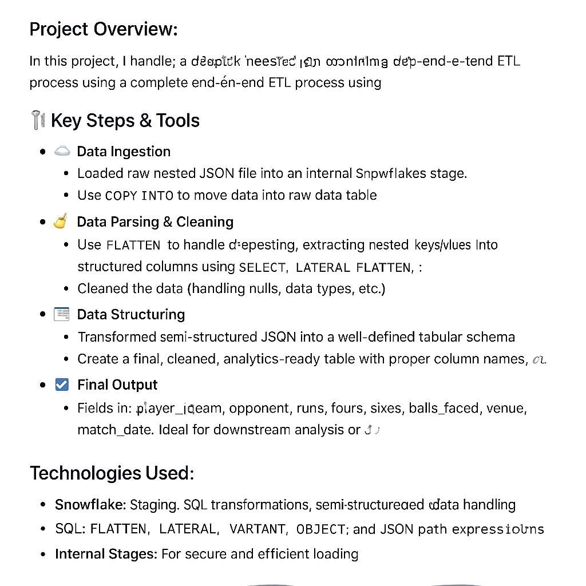

# 🏏 Cricket Data ETL with Snowflake (Handling Deeply Nested JSON)

This project demonstrates an end-to-end ETL pipeline using **Snowflake** to ingest, parse, and structure **deeply nested JSON data** related to world cricket records.

---

## 📌 Project Overview

Handled a large-scale nested JSON dataset of global cricket records by:

- Loading it into **Snowflake internal stages**
- Parsing and flattening nested structures
- Structuring and cleaning data into an analytics-ready format

---

## 🛠️ Key Steps & Tools

### ☁️ Data Ingestion
- Loaded raw nested JSON file into an **internal Snowflake stage**
- Used `COPY INTO` to ingest data into a **raw variant table**

### 🧹 Data Parsing & Cleaning
- Used `FLATTEN` to unpack deeply nested arrays
- Extracted JSON fields using `:` syntax and `LATERAL FLATTEN`
- Handled nulls, type casting, and key-value extraction

### 🏗️ Data Structuring
- Converted semi-structured JSON into well-defined columns
- Created a cleaned final table for analysis

### 📦 Final Output
- Final table contains structured columns like:
  - `player_id`, `name`, `team`, `opponent`, `runs`, `balls_faced`, `sixes`, `fours`, `venue`, `match_date`, etc.

---

## 🔧 Technologies Used

| Tool        | Purpose                                          |
|-------------|--------------------------------------------------|
| **Snowflake** | Data staging, transformation, and storage        |
| **SQL**       | Flattening, lateral joins, JSON parsing          |
| **Internal Stage** | Secure and efficient file ingestion              |

---

## 📊 Visual ETL Workflow

---

## 
---

## 📣 Author

**Zain Ul Abideen Alvi**  
_Data Engineer | AI Developer_  
[LinkedIn](https://www.linkedin.com/in/zain-ul-abideen-alvi-32b3b6275/) | [Email](mailto:zainalvi552@gmail.com)

---

⭐ If you found this helpful, give the repo a star!

